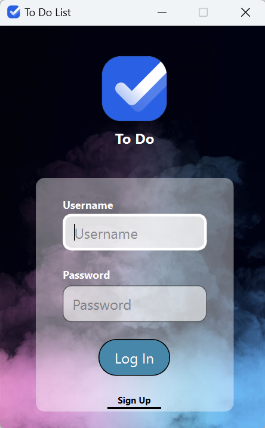
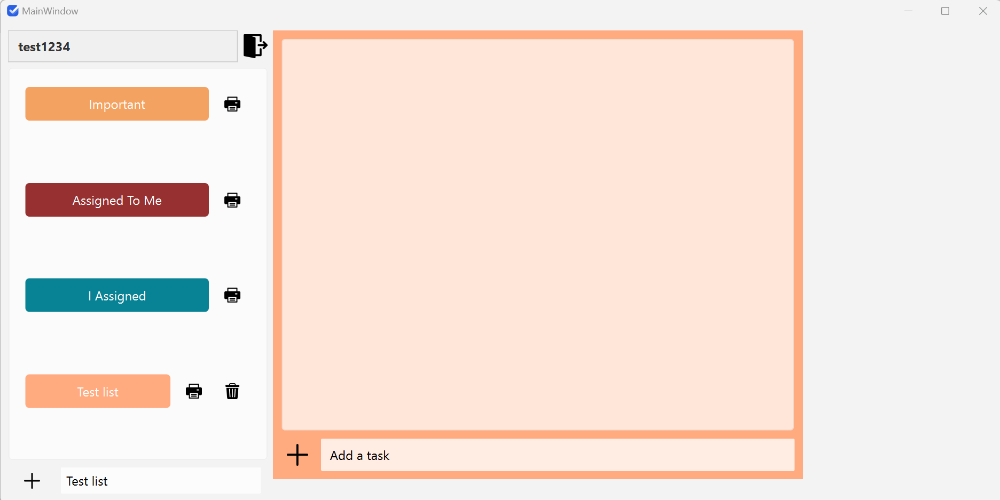
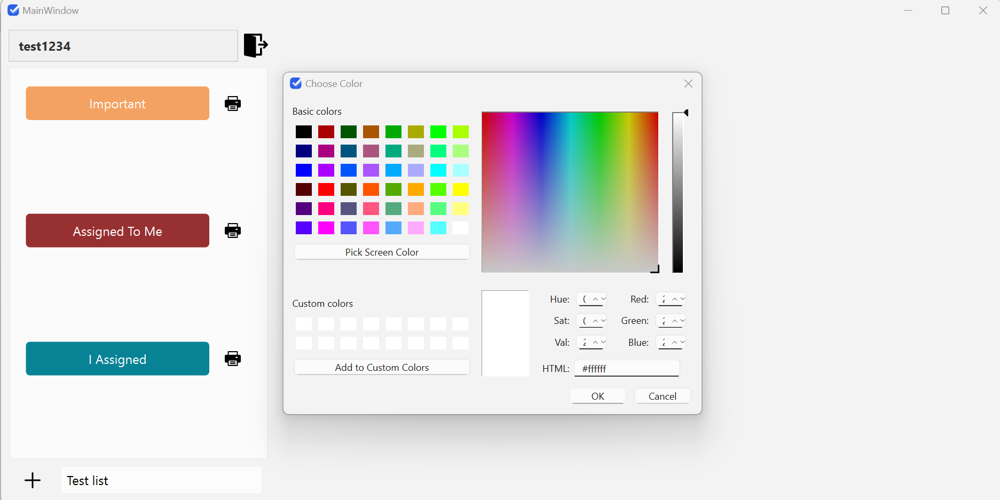
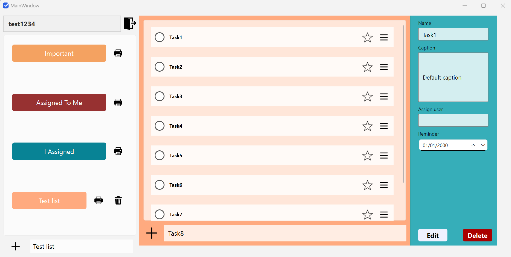
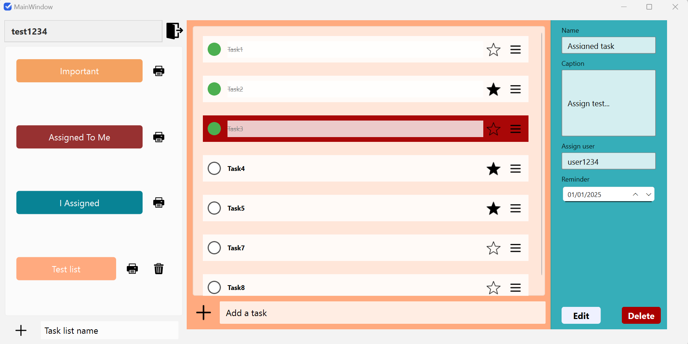
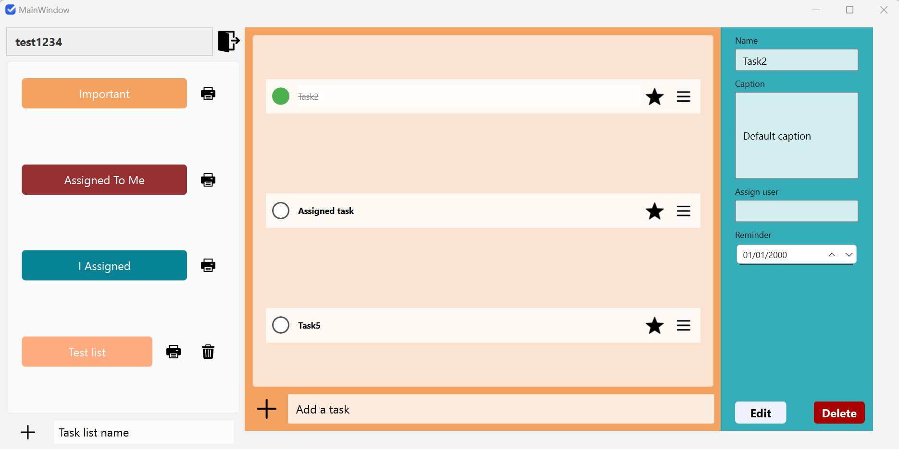
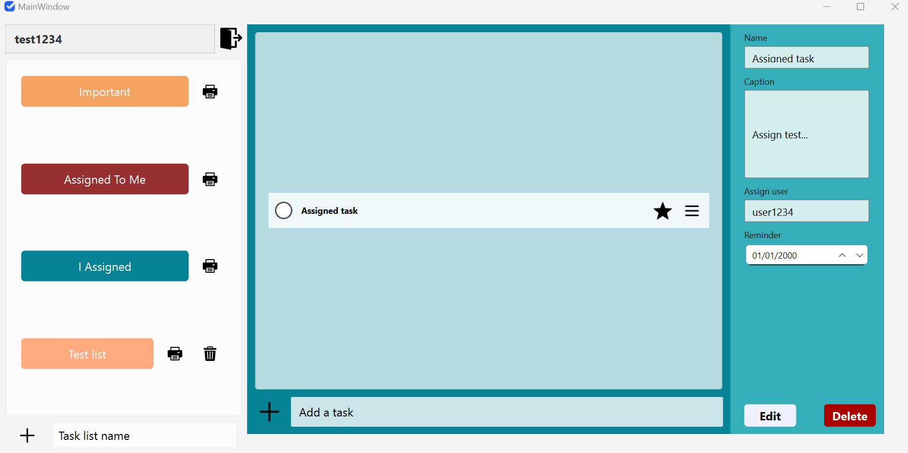
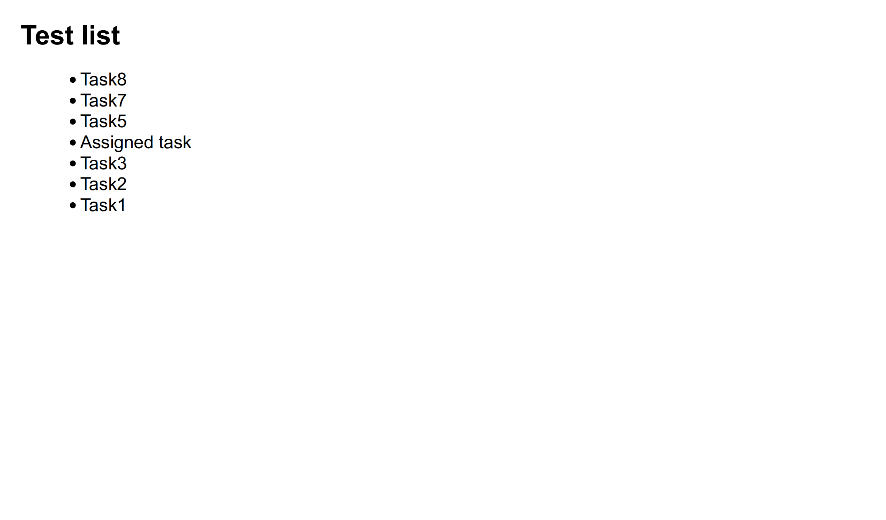

# To Do List
This project simulates a task management software as part of the advanced programming course. It incorporates various lessons learned, diverse capabilities, and creative implementations.

---

## Features
This project includes the following features:

- **User Account Creation and Login**: 
  - Create different user accounts and save information.
  - 

- **Create Multiple Lists**: 
  - Create different lists with unique names and colors.
  - 
  - 

- **Add Tasks to Each List**: 
  - Each task must have the following attributes:
    - Task Name
    - Starred Option
    - Deadline Notification: 
      - Every time the program starts, it should compare the current date with the deadlines of each task and notify the user if they are the same.
  - 
    
- **Add Description to Each Task**: 
  - Include detailed descriptions for each task.

- **Check Task Completion**: 
  - Ability to mark tasks as completed or not.

- **Assign Tasks to Specific Users**: 
  - Assign a task to a specific user.
  - 

- **Display Starred Tasks**: 
  - Show a list of all starred tasks.
  - 

- **Display Tasks Assigned to Each User**: 
  - Show a list of tasks assigned to each user.
  - 

- **Export List to PDF**: 
  - Ability to export a specific list to PDF format.
  - 

---

This project provides a comprehensive approach to learning and implementing advanced programming concepts, including user management, task organization, and data storage.
